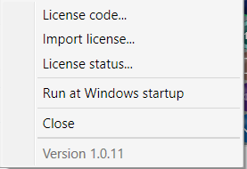
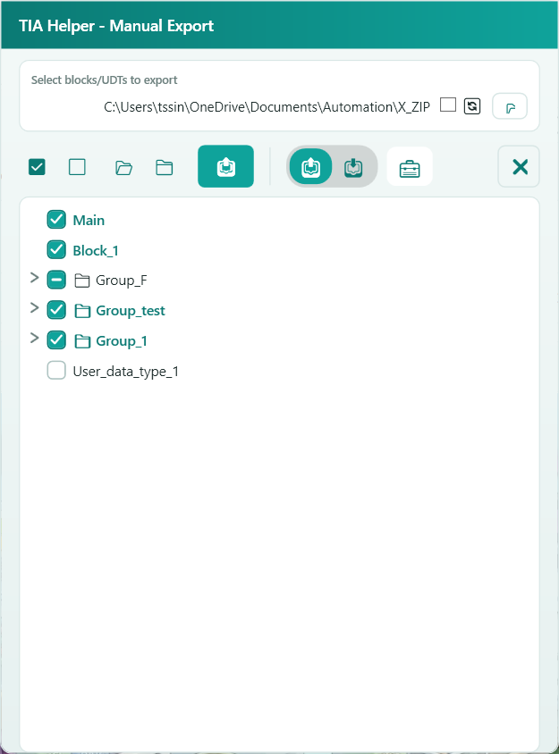
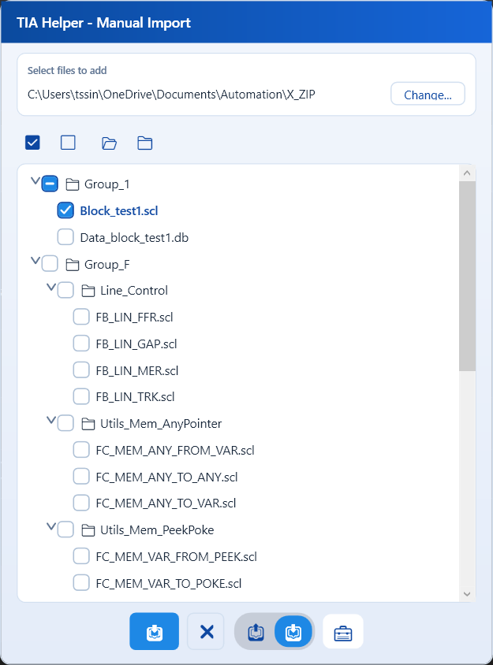
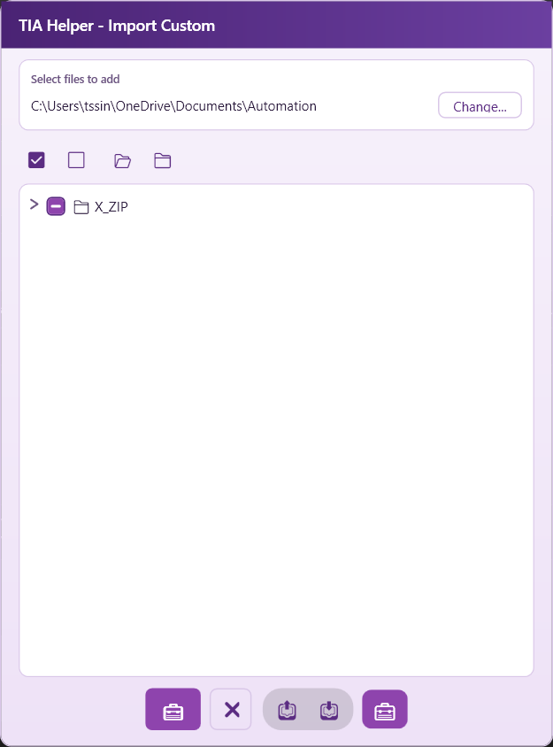
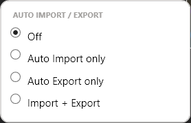
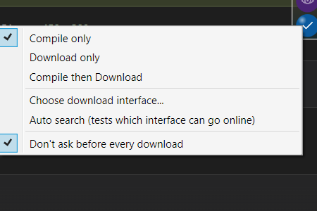
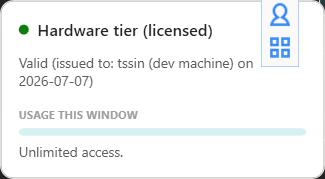

# TIA Helper 🚂✨

  
  
  

**The AI bridge to TIA Portal.** 🐣 TIA Helper is a small floating toolbar that connects
Siemens TIA Portal to your AI coding assistant — Claude, GPT, or any tool that can write
SCL — so you can write, import, and compile PLC program blocks with one click, or let the
AI do it for you through the exact same interface a human uses. 🤖🔌

## ✨ What it does

| | |
|---|---|
| 📥 **Import** | Drop an SCL file straight into TIA Portal — generates or overwrites the block for you. |
| 🛠️ **Compile** | One click, clean error/warning summary. No digging through TIA Portal's own UI. |
| 📤 **Export** | Any block or UDT → a plain SCL file, so an AI can read your code before touching it. |
| 🏷️ **Symbol Tool** | Build a tag template once ("Motor" → Run/Fault/Speed), set an address rule, and generate a whole tag table in one click — no more hand-typing 50 nearly-identical tags. |
| 🔁 **Auto mode** | Watch a file (or the whole project) — the moment something changes, it re-imports/re-exports itself. Zero clicks. |
| 🧠 **AI-native** | Every button doubles as a pipe command. Your AI assistant can list, attach, import, compile, and report back — the same loop you do, on autopilot. |
| 🔒 **Downloads stay yours** | Writing to real hardware always needs a manual click + confirmation in the app. The AI can tell you what it *would* do — it can never do it for you. |

## ⬇️ Download

  

  

No installer, no fuss — download it, double-click it, done. 🎉 (You still need TIA Portal
itself installed on your computer — this little buddy rides along with it, it doesn't
replace it!)

## 📖 How to use it

A little floating buddy 🚂 with 5 buttons. Tap a section below to peek inside. 👇

🧰 The toolbar

A small floating column of buttons that stays on top of your other windows.

Top to bottom:

1. **T badge** — drag to move the toolbar around, click (without dragging) to
   collapse/expand it, right-click for the license/settings menu.
2. **Usage gauge** — click to see your license tier and how much usage quota is left.
3. **Export / Import** (one shared slot — shows whichever you used last) — **left-click
   runs it immediately**, **right-click** opens the picker.
4. **Auto mode** (the eye 👁️) — left-click toggles it on/off, right-click picks the mode.
5. **Run** (the checkmark ✔️) — left-click compiles/downloads, right-click for settings.

Click the badge once to shrink the whole thing down to just itself:

**Keyboard shortcuts** (work globally, even while TIA Portal is focused): 🎹

| Shortcut | Does |
|---|---|
| `Alt+Z` | Opens the Export page |
| `Alt+X` | Opens the Import page |
| `Alt+C` | Opens the Custom Import page |
| `Alt+D` | Collapses/expands the toolbar |

🔑 Licensing & settings (right-click the badge)

- **License code...** — shows your hardware code. Send it to whoever issues your license.
- **Import license...** — paste in the license file you were sent.
- **License status...** — opens the usage popup (see below).
- **Run at Windows startup** — launch TIA Helper automatically when you log in.
- **Show Symbol Tool button** — turn on the 🏷️ tag-table tool (off by default to keep the toolbar tidy).
- **Sync export selection → import** — when on, whatever you check on the Export page is also copied into the Import page's selection. One global switch that applies to every project.

📤 Export — send PLC blocks out to files

Right-click the Export button to pick which blocks/UDTs to export and where:

- Check the blocks/UDTs you want in the tree (checking a folder checks everything under
  it).
- **Change...** picks the destination folder — TIA Helper auto-creates a subfolder named
  after your TIA project, so different projects never mix their files.
- The icons above the tree are **Select all / Clear / Expand all / Collapse all**. The 🔄
  checkbox syncs your Export selection straight into Import's own selection.
- Re-exporting only touches blocks that actually changed since the last export — nothing
  else gets re-written, so re-exporting a big project stays fast.
- Click the export icon at the bottom to run it right now.

📥 Import — bring SCL files into TIA Portal

Same picker, pointed at a local folder instead of your TIA project:

- Check a file to queue it for import.
- Left-clicking the toolbar's Import button re-imports whichever file was last active —
  handy right after editing it in your own editor.
- **Auto mode** can watch every checked file and re-import automatically the instant you
  save it.

🧳 Custom — a second, independent import folder

Reached via the little toolbox icon inside Export/Import's own popup. Works exactly like
Import, but remembers its own separate folder — handy for one-off imports that shouldn't
touch your regular Import destination.

🏷️ Symbol Tool — generate a whole tag table from one template

For anyone who's ever had to type out `Motor1_Run`, `Motor1_Fault`, `Motor1_Speed`,
`Motor2_Run`, `Motor2_Fault`... one at a time. Four tabs:

1. **Templates** — define a reusable set of fields once (name suffix, data type, address
   offset). One "Motor" template can describe every motor in the plant.
2. **Address Rules** — pick a template, a start address, how far apart each instance
   should be, and how many to generate. TIA Helper works out every individual address.
3. **Regex Rules** *(optional)* — paste in a big list of existing names and auto-sort
   them by which template they match.
4. **Generate & Preview** — see every tag before anything happens, then either write them
   straight into the TIA project or export the list as an Excel file.

> 💡 **New here?** Click **🎓 Load Example** on the Templates tab to fill every tab with a
> complete worked example (Motor + Valve templates, ready-made address rules, and matching
> regex rules). Try **Generate** right away to see it produce real tags — then edit or clear
> it and build your own. Everything you build is saved automatically to
> `symbol-workspace.json` next to the app, and is shared across all your TIA projects.

🔁 Auto mode — hands-free Import/Export

Right-click the eye icon:

- **Off** — nothing runs automatically.
- **Auto Import only** — watches every file checked in Import's/Custom's tree; the moment
  one changes on disk, it's re-imported automatically.
- **Auto Export only** — watches your TIA project file itself; the moment you save in TIA
  Portal, your saved Export selection is re-exported automatically.
- **Import + Export** — both at once.

Left-click is a quick on/off switch that remembers whichever mode you picked last.

▶️ Run — Compile and Download

Right-click the checkmark button:

- **Compile only / Download only / Compile then Download** — what left-clicking Run
  actually does.
- **Choose download interface...** — pick which PG/PC interface to use, or let TIA Helper
  auto-search for one that works.
- **Don't ask before every download** — skips the confirmation dialog. Downloading always
  writes to real hardware, so leave this on unless you're sure. ⚠️

📊 License & usage

🤝 Working with an AI assistant

TIA Helper exposes every one of these actions over a local named pipe, so an AI coding
assistant can drive it exactly like you do by clicking — list running TIA Portal
instances, attach to the right project, import code it just wrote, compile, and read back
the result. Ask your AI assistant to check whether TIA Helper is running if you want to
try this.

**Downloading to hardware is always a manual step** — an AI assistant can tell you what a
download would target, but it can never trigger one itself.

📄 See **[docs/NAMED_PIPE.md](docs/NAMED_PIPE.md)** for the full command reference,
example scripts, and safety rules — point your AI assistant at that file and it can
learn the whole protocol in one read.

**Prefer MCP?** There's also a ready-made [MCP (Model Context Protocol)](docs/MCP.md)
server — if your AI client speaks MCP natively (Claude Desktop, Claude Code, etc.), it
can call TIA Helper's actions as real tools instead of shell commands, with no scripting
needed on your end. Same underlying protocol, same safety rules, just a different way in.

## 🔑 License

Free to use under the terms in [LICENSE.md](LICENSE.md). Right-click the floating icon
and choose **License code...** to get your hardware code, then follow the instructions
to request a license.

## 📦 Source

This repository hosts release builds only. Source code is maintained privately.

---

Made with ☕ and a lot of clicking on TIA Portal's own UI, so you don't have to.

