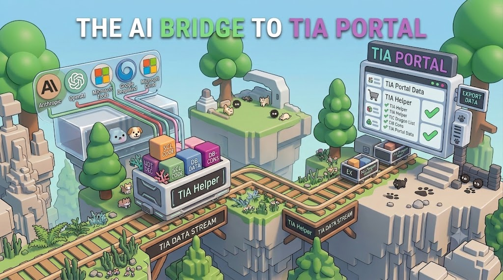

# TIA Helper

**The AI bridge to TIA Portal.** TIA Helper is a small floating toolbar that connects
Siemens TIA Portal to your AI coding assistant — Claude, GPT, or any tool that can write
SCL — so you can write, import, and compile PLC program blocks with one click, or let the
AI do it for you through the exact same interface a human uses.

## What it does

- **Import** an SCL file straight into TIA Portal, generating or overwriting the block.
- **Compile** the PLC software and get a clean error/warning summary back.
- **Export** any block or UDT out to an SCL file, so an AI can read your existing code
  before changing it.
- **Auto mode** — watch a file (or the whole project) and automatically re-import or
  re-export the moment something changes, no manual clicking required.
- **AI-native** — every button on the toolbar is also a command on a local named pipe.
  An AI assistant working in your editor can list running TIA Portal instances, attach to
  the right one, import code, compile, and report back errors — the same loop a human
  goes through, just automated.
- **Download stays a human decision.** Writing to real hardware always requires a manual
  click and on-screen confirmation in the app itself — the AI can tell you what a download
  would target, but it can never trigger one.

## Download

Grab the latest `TiaWpf.exe` from the [Releases](../../releases) page and run it — no
installer needed. TIA Portal must be installed on the same machine.

## User guide

See [docs/USER_GUIDE.md](docs/USER_GUIDE.md) for a full walkthrough of the toolbar,
Export/Import/Custom, Auto mode, and Compile/Download — with screenshots.

## License

Free to use under the terms in [LICENSE.md](LICENSE.md). Right-click the floating icon
and choose **License code...** to get your hardware code, then follow the instructions
to request a license.

## Source

This repository hosts release builds only. Source code is maintained privately.
