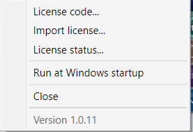
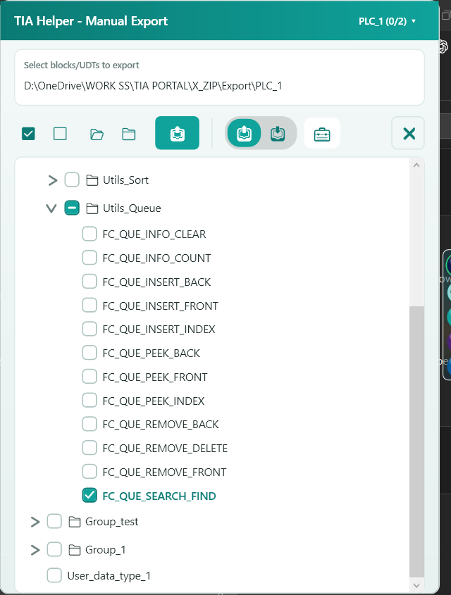
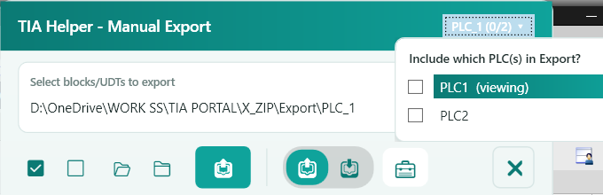
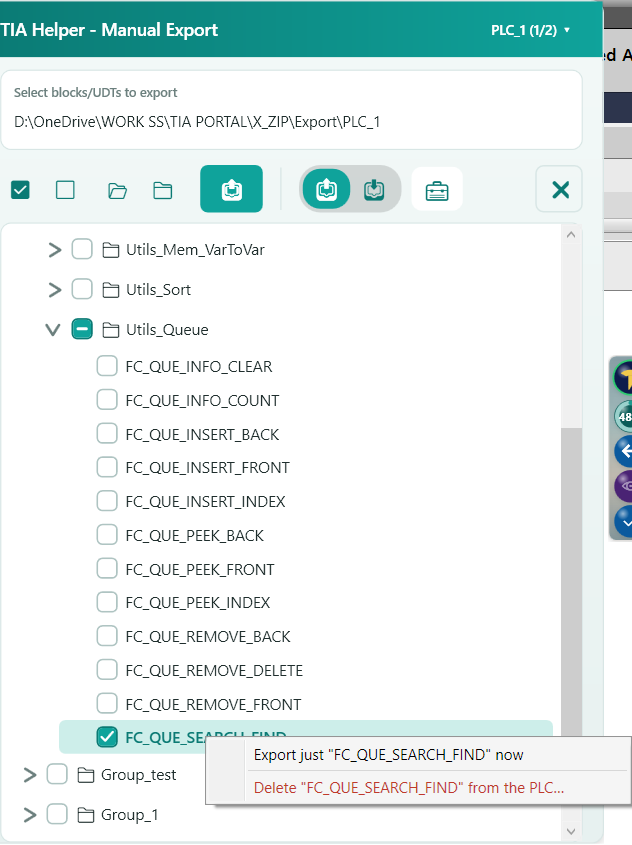
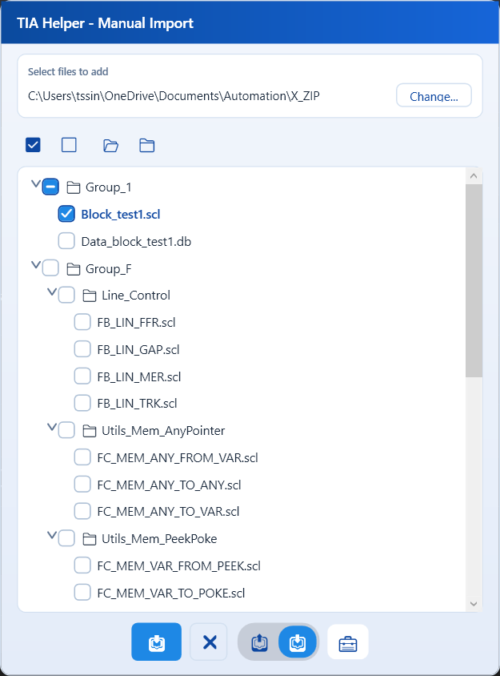
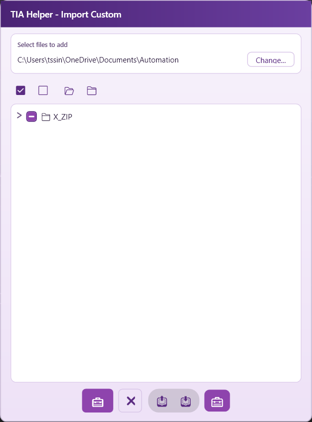
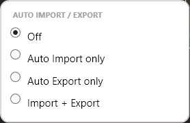
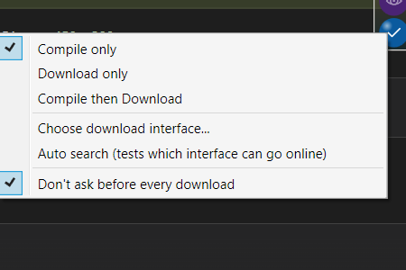
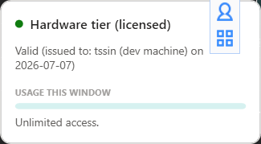

<p align="center">

# TIA Helper 🚂✨

</p>


<p align="center">
  
  
  
</p>

**The AI bridge to TIA Portal.** 🐣 TIA Helper is a small floating toolbar that connects
Siemens TIA Portal to your AI coding assistant — Claude, GPT, or any tool that can write
SCL — so you can write, import, and compile PLC program blocks with one click, or let the
AI do it for you through the exact same interface a human uses. 🤖🔌

## ✨ What it does

| | |
|---|---|
| 📥 **Import** | Drop an SCL file straight into TIA Portal — generates or overwrites the block for you. |
| 🛠️ **Compile** | One click, clean error/warning summary. No digging through TIA Portal's own UI. Off by default, turn it on from the badge menu. |
| 📤 **Export** | Any block or UDT → a plain SCL file, so an AI can read your code before touching it. |
| 🏷️ **Symbol Tool** | Build a tag template once ("Motor" → Run/Fault/Speed), set an address rule, and generate a whole tag table in one click — no more hand-typing 50 nearly-identical tags. Off by default, turn it on from the badge menu. |
| 🔁 **Auto mode** | Watch a file (or the whole project) — the moment something changes, it re-imports/re-exports itself. Zero clicks. Off by default, turn it on from the badge menu. |
| 📋 **Task queue** | Click Export/Import as fast as you want — everything queues up and runs in order, no lost clicks. A little popup shows you what's running, what's next, and what already finished. |
| 🧠 **AI-native** | Every button doubles as a pipe command. Your AI assistant can list, attach, import, compile, and report back — the same loop you do, on autopilot. |
| 🔒 **Downloads stay yours** | Writing to real hardware always needs a manual click + confirmation in the app. The AI can tell you what it *would* do — it can never do it for you. |

## ⬇️ Download

<p align="center">
  <a href="https://github.com/sstan1020/TIA-Helper-Release/releases/latest/download/TiaHelper.exe">
    
  </a>
</p>

<p align="center">
  <a href="../../releases/latest">
    
  </a>
</p>

No installer, no fuss — download it, double-click it, done. 🎉 (You still need TIA Portal
itself installed on your computer — this little buddy rides along with it, it doesn't
replace it!)

## 📖 How to use it

A little floating buddy 🚂. Manual Export/Import is all you see by default; Auto mode,
Compile/Download, and the 🏷️ Symbol Tool are all one click away in the right-click menu
when you want them. Tap a section below to peek inside. 👇

<details>
<summary>🧰 The toolbar</summary>

A small floating column of buttons that stays on top of your other windows. By default
it's just three things — Manual Export/Import covers the vast majority of day-to-day
work, so that's all you see until you ask for more:


1. **T badge** — drag to move the toolbar around, click (without dragging) to
   collapse/expand it, right-click for the license/settings menu.
2. **Usage gauge** — click to see your license tier and how much usage quota is left.
3. **Export / Import** (one shared slot — shows whichever you used last) — **left-click
   runs it immediately**, **right-click** opens the picker, **scroll the mouse wheel over
   it** to quickly switch between Export/Import/Custom.

Click the badge once to shrink the whole thing down to just itself.

**Auto mode and Compile/Download are hidden by default** — right-click the badge →
**Toolbar buttons** to turn either one on if you need it:

- **Auto mode** (the eye 👁️, once shown) — left-click toggles it on/off, right-click picks
  the mode.
- **Run** (the checkmark ✔️, once shown) — left-click compiles/downloads, right-click for
  settings.

**Keyboard shortcuts** (work globally, even while TIA Portal is focused): 🎹

| Shortcut | Does |
|---|---|
| `Alt+Z` | Opens the Export page |
| `Alt+X` | Opens the Import page |
| `Alt+C` | Opens the Custom Import page |
| `Alt+D` | Collapses/expands the toolbar |

</details>

<details>
<summary>🔑 Licensing & settings (right-click the badge)</summary>



- **License code...** — shows your hardware code. Send it to whoever issues your license.
- **Import license...** — paste in the license file you were sent.
- **License status...** — opens the usage popup (see below).
- **Run at Windows startup** — launch TIA Helper automatically when you log in.
- **Toolbar buttons** — a submenu to turn on the buttons that are hidden by default: Symbol
  Tool, Auto mode, Compile/Download.
- **Sync export → import** — a submenu with 3 modes (pick one): **Off** (no syncing), **Only checked** (checking a block on Export/Import adds it to the other side, but unchecking never removes anything — add-only), **Mirror** (checking *and* unchecking are copied both ways, so Export and Import always match exactly). Works in both directions — check something in Import and it flows back into Export too.

</details>

<details>
<summary>📤 Export — send PLC blocks out to files</summary>

Right-click the Export button to pick which blocks/UDTs to export and where:



- Check the blocks/UDTs you want in the tree (checking a folder checks everything under
  it). Your checks, which folders you left expanded/collapsed, and even the tree's scroll
  position are all remembered per project — and now survive a real app restart, not just
  while the app keeps running.
- Destination is auto-derived from your TIA project's own file location — a subfolder
  named after your project, so different projects never mix their files.
- The icons above the tree are **Select all / Clear / Expand all / Collapse all**.
- Opens instantly the second time onward — the block list is cached after the first
  connect, and quietly refreshes itself in the background (including the moment right
  after TIA Portal is connected) so you're never waiting on it.
- Re-exporting only touches blocks that actually changed since the last export — nothing
  else gets re-written, so re-exporting a big project stays fast.
- Click the export icon at the bottom to run it right now — it dims when there's nothing
  selected or no destination set yet, same as the toolbar's own Export/Import button.
- **Multiple PLCs in one project?** A badge in the top-right corner (e.g. `PLC_1 (1/2)`)
  lets you pick which PLC's tree you're looking at *and* which PLC(s) actually get covered
  when Export runs — check more than one and a single Export run covers all of them:

  

- **Right-click any block/UDT (or a whole folder) for a quick one-off menu** — export just
  that item right now regardless of what's checked, or (for a single block/UDT) delete it
  from the PLC entirely. Deleting asks you to type the block's name to confirm first —
  there's no undo, so make sure you have your own project backup:

  

</details>

<details>
<summary>📥 Import — bring SCL files into TIA Portal</summary>

Same picker, pointed at a local folder instead of your TIA project:



- Check a file to queue it for import.
- Left-clicking the toolbar's Import button re-imports whichever file was last active —
  handy right after editing it in your own editor.
- Right-click a file (or a whole folder) for the same one-off "import just this now"
  shortcut Export has — no need to check it first.
- **Auto mode** can watch every checked file and re-import automatically the instant you
  save it.
- If **Sync export → import** (badge menu) isn't Off, checking/unchecking files here also
  updates the Export page's own selection, following whichever of the two sync modes
  you picked.

> **Where imported blocks land**: TIA Portal's own API for generating a block from an SCL
> file has no way to target a specific folder — it always lands at your PLC's top level
> first. TIA Helper now automatically relocates it afterward to match the file's own
> folder (e.g. a file at `Group_F\Utils_Queue\FC_X.scl` ends up in that same
> `Group_F/Utils_Queue` group in TIA, creating the group if it doesn't exist yet) — this
> only applies to the **Import** page (not Custom, whose folder has no set relationship
> to your TIA structure). If the relocate step itself ever fails for some reason, the
> block is safely restored to the top level rather than lost.

</details>

<details>
<summary>🧳 Custom — a second, independent import folder</summary>

Reached via the little toolbox icon inside Export/Import's own popup. Works exactly like
Import, but remembers its own separate folder — handy for one-off imports that shouldn't
touch your regular Import destination.



</details>

<details>
<summary>🏷️ Symbol Tool — generate a whole tag table from one template</summary>

For anyone who's ever had to type out `Motor1_Run`, `Motor1_Fault`, `Motor1_Speed`,
`Motor2_Run`, `Motor2_Fault`... one at a time. Four tabs:

1. **Templates** — define a reusable set of fields once (name suffix, data type, address
   offset). One "Motor" template can describe every motor in the plant.
2. **Address Rules** — pick a template, a start address, how far apart each instance
   should be, and how many to generate. TIA Helper works out every individual address.
3. **Regex Rules** *(optional)* — paste in a big list of existing names and auto-sort
   them by which template they match.
4. **Generate & Preview** — see every tag before anything happens, then either write them
   straight into the TIA project or export the list as an Excel file.

> 💡 **New here?** Click **🎓 Load Example** on the Templates tab to fill every tab with a
> complete worked example (Motor + Valve templates, ready-made address rules, and matching
> regex rules). Try **Generate** right away to see it produce real tags — then edit or clear
> it and build your own. Everything you build is saved automatically to
> `symbol-workspace.json` next to the app, and is shared across all your TIA projects.

</details>

<details>
<summary>🔁 Auto mode — hands-free Import/Export</summary>

Right-click the eye icon:



- **Off** — nothing runs automatically.
- **Auto Import only** — watches every file checked in Import's/Custom's tree; the moment
  one changes on disk, it's re-imported automatically.
- **Auto Export only** — watches your TIA project file itself; the moment you save in TIA
  Portal, your saved Export selection is re-exported automatically.
- **Import + Export** — both at once.

Left-click is a quick on/off switch that remembers whichever mode you picked last.

</details>

<details>
<summary>▶️ Run — Compile and Download</summary>

Right-click the checkmark button:



- **Compile only / Download only / Compile then Download** — what left-clicking Run
  actually does.
- **Choose download interface...** — pick which PG/PC interface to use, or let TIA Helper
  auto-search for one that works.
- **Don't ask before every download** — skips the confirmation dialog. Downloading always
  writes to real hardware, so leave this on unless you're sure. ⚠️

</details>

<details>
<summary>📊 License & usage</summary>



</details>

<details>
<summary>🤝 Working with an AI assistant</summary>

TIA Helper opens a local **named pipe** called `tia_helper` the moment it starts — think
of it as a phone line only your AI assistant needs to know about. Every button in the
toolbar (list projects, attach, import, compile, export...) is also a one-line command
your AI can send down that pipe, get an answer back, and hang up. There are two ways for
an AI to actually use it — pick whichever fits your AI tool. Both talk to the exact same
pipe, so both are equally capable.

### Option 1: MCP (easiest — no scripting, if your AI supports it)

If your AI client speaks **MCP** (Model Context Protocol) — Claude Code, Claude Desktop,
and others do — this is the simplest way in: TIA Helper's actions show up as real, native
tools (`tia_status`, `tia_compile`, `tia_export`, ...) that the AI can call directly, the
same way it'd call any of its other built-in tools.

**Setup (Claude Code example, one-time only):**

```powershell
# 1. Make sure Node.js is installed (node --version to check)
# 2. Download the mcp-server folder from this repo, then:
cd "path\to\mcp-server"
npm install
claude mcp add tiahelper -- node "path\to\mcp-server\index.js"
```

That's it. From then on, just talk to your AI normally:

> **You:** Compile the current PLC program and tell me if there are any errors.
>
> **AI:** *(calls the `tia_compile` tool)* → Compile finished: 0 errors, 2 warnings.
> Here's what the warnings say...

No commands to type, no paths to remember after setup. Full walkthrough with screenshots:
**[docs/MCP.md](docs/MCP.md)**.

### Option 2: Named pipe directly (works with any AI that can run a terminal command)

If your AI tool can execute shell/PowerShell commands but doesn't speak MCP, download
[`tia.ps1`](tia.ps1) from this repo and just ask your AI in plain language — it'll figure
out which command to run:

> **You:** What TIA project is currently open?
>
> **AI:** *(runs `powershell -File tia.ps1 -Command "status"`)* → You have
> `X_ZIP.ap20` open, connected to PLC `PLC_1`.

You can also try it yourself directly in a terminal, to see exactly what the AI sees:

```powershell
powershell -File tia.ps1 -Command "list"
# 0: D:\Projects\X_ZIP\X_ZIP.ap20

powershell -File tia.ps1 -Command "attach X_ZIP"
# Connected: D:\Projects\X_ZIP\X_ZIP.ap20 | PLC: PLC_1

powershell -File tia.ps1 -Command "compile"
# Compile finished: 0 errors 0 warnings
```

Full command reference, more examples, and safety rules:
**[docs/NAMED_PIPE.md](docs/NAMED_PIPE.md)**.

### What your AI can and can't do

| ✅ Can do (no confirmation needed) | 🔒 Can't do (needs you, in the app) |
|---|---|
| List/attach to TIA projects | **Download to real hardware** — always your click + your confirmation in the app window |
| Import SCL code it wrote, generate/overwrite blocks | |
| Compile and read back errors/warnings | |
| Export existing blocks (SCL, or lossless XML for Ladder/FBD) | |
| Preview what a download *would* target, list available interfaces | |
| Switch between projects/PLCs if you have several open | |

Writing to real hardware is deliberately the one thing no AI path can trigger — it always
needs your own click on the **Run** button and your own confirmation in the popup that
follows, no matter how you're talking to TIA Helper.

</details>

## 🔑 License

Free to use under the terms in [LICENSE.md](LICENSE.md). Right-click the floating icon
and choose **License code...** to get your hardware code, then follow the instructions
to request a license.

## 📦 Source

This repository hosts release builds only. Source code is maintained privately.

---

<p align="center">Made with ☕ and a lot of clicking on TIA Portal's own UI, so you don't have to.</p>
