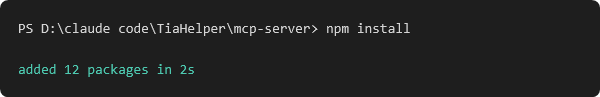
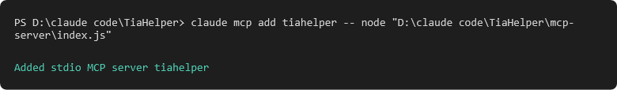
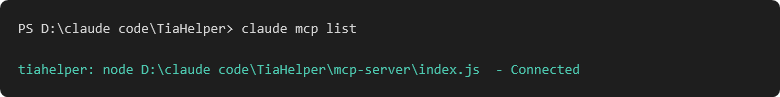
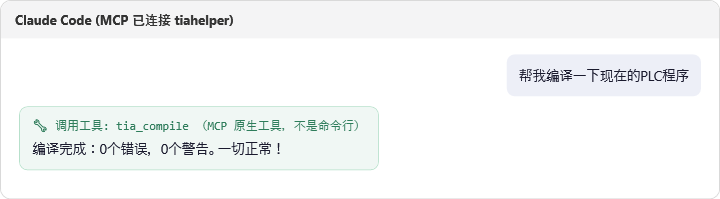

# MCP 超详细使用教程 — 完全新手版

这篇教程教你怎么把 TIA Helper 接到 AI 助手上，**比命名管道（[NAMED_PIPE.md](NAMED_PIPE.md)）
更简单**——AI 不需要打命令行，直接把 TIA Helper 的功能当成自己的"技能"来用。本教程用
**Claude Code** 举例。

不需要写代码。跟着做，5分钟搞定。

---

## 第一步：MCP 到底是什么？跟命名管道有什么不一样？

先说人话版本：

- **命名管道**（上一篇教程）：AI 需要知道"打命令行"这个概念，每次都要拼一行文字命令，
  比如 `powershell -File tia.ps1 -Command "list"`。
- **MCP**（这一篇）：AI 直接看到一排"现成的按钮"（专业名字叫"工具"），比如一个叫
  `tia_compile` 的按钮，AI 直接"按"这个按钮就行，**不需要自己拼命令行**。

打个比方：命名管道像是"打电话，说暗号"；MCP 像是"手机上直接有个 App，点一下图标就行"。

**这两个东西背后做的事情其实一模一样**——都是连到 TIA Helper 那根"电话线"上，
只是 MCP 帮你把"怎么说暗号"这一层也包装好了，AI 用起来更省心。

---

## 第二步：你需要准备什么

只需要两样东西，都是免费的：

1. **TIA Helper** 正在运行（跟平时一样，能看到浮动圆形工具栏）。
2. **Node.js** —— 一个免费的小程序运行环境。如果你不确定有没有装过，打开一个终端
   （Windows 里搜索"PowerShell"打开），输入：

   ```powershell
   node --version
   ```

   如果显示一个版本号（比如 `v20.11.0`），说明已经装过了，跳到第三步。
   如果提示"找不到命令"，去 [nodejs.org](https://nodejs.org) 下载安装包，一路"下一步"装完，
   然后重新打开终端再试一次上面这行命令确认。

---

## 第三步：下载"工具箱"文件夹

1. 从这个仓库下载整个 [`mcp-server`](../mcp-server) 文件夹，保存到你电脑上，
   比如 `D:\claude code\TiaHelper\mcp-server`。

   这个文件夹里的东西你不需要看懂，只需要知道：里面有个 `index.js`，
   它就是"工具箱"本身——它把 TIA Helper 能做的每件事（编译、导入、导出……）都包装成
   一个个"工具"给 AI 用。

2. 打开终端，进到这个文件夹，装一次"零件"（只需要做一次）：

   ```powershell
   cd "D:\claude code\TiaHelper\mcp-server"
   npm install
   ```

   跑完之后你会看到类似这样的结果：

   

   看到 `added N packages` 就说明成功了。

---

## 第四步：告诉 Claude Code "这里有个新工具箱"

打开终端，运行这一行命令（**记得把路径换成你自己保存 `mcp-server` 文件夹的实际路径**）：

```powershell
claude mcp add tiahelper -- node "D:\claude code\TiaHelper\mcp-server\index.js"
```

成功的话会看到：



这行命令翻译成人话就是："嘿 Claude，以后你多一个叫 `tiahelper` 的工具箱可以用，
它在这个路径下"。

**这一步只需要做一次** —— 以后每次打开 Claude Code，它都会自动记得这个工具箱。

---

## 第五步：确认连上了

跑这一行确认一下：

```powershell
claude mcp list
```

如果看到 `tiahelper` 后面写着 `Connected`（已连接），就说明一切正常：



如果显示的是别的状态（比如 `Failed`），最常见的原因是：

- TIA Helper 那个软件没有开着 —— 打开它再试。
- 路径打错了 —— 回到第四步，确认路径跟你实际保存的文件夹位置完全一致。

---

## 第六步：直接跟 Claude Code 说话就行了

设置到这里就全部完成了。之后你完全不需要再想"命令行""路径"这些东西——
直接跟 Claude Code **说人话**：

> 帮我编译一下现在的PLC程序

Claude Code 会自动调用工具箱里的 `tia_compile` 这个"按钮"，帮你编译，再把结果讲给你听：



注意看那一行绿色小字 —— `调用工具: tia_compile`，这就是 MCP 跟命令行版本
最大的区别：AI 是直接"按工具按钮"，不是打字拼命令。

---

## 第七步：这个工具箱里都有哪些"按钮"？

下面这些"按钮"（工具）跟 [NAMED_PIPE.md](NAMED_PIPE.md) 里的暗号是一一对应的
——你不需要记住，Claude Code 自己知道什么时候该用哪个：

| 工具名字 | 干什么用的 |
|---|---|
| `tia_list` | 看看现在有哪些 TIA 项目开着 |
| `tia_attach` | 连接到指定的项目 |
| `tia_autoattach` | 自动连接（只有一个项目开着时才行） |
| `tia_status` | 看看现在连的是哪个项目/PLC |
| `tia_detach` | 断开连接 |
| `tia_exportlist` | 列出所有可以导出的程序块 |
| `tia_import` | 导入一段代码到 PLC |
| `tia_export` | 把某个程序块导出成文件 |
| `tia_exportxml` | 导出任何类型的程序块（包括梯形图） |
| `tia_exportxmlall` | 批量导出所有梯形图类的程序块 |
| `tia_compile` | 编译 PLC 程序 |
| `tia_downloadpreview` | 预览一下"下载"会做什么（不会真的下载） |
| `tia_downloadinterfaces` | 列出可用的下载接口 |
| `tia_selectdownloadinterface` | 选择用哪个下载接口 |

**注意：这个列表里故意没有"真正下载到硬件"这个按钮。** 跟命名管道版本一样，这是
故意设计成这样的——下载到真实 PLC 硬件必须由你自己在软件界面上点击、亲眼看到确认框、
自己按下确认，AI 永远无法代替你做这一步。完整的安全规则说明见
[NAMED_PIPE.md 第六步](NAMED_PIPE.md#第六步三条你必须知道的安全规则)，
两边共用同一套规则。

---

## 常见问题

**Q: 我要重新装一次 mcp-server 吗？每次开机都要吗？**
不用。`npm install` 和 `claude mcp add` 都只需要做一次。以后正常开机、打开 Claude Code
就行，工具箱会一直在那儿。

**Q: MCP 和命名管道，我应该选哪个？**
如果你的 AI 工具支持 MCP（比如 Claude Code、Claude Desktop），**优先选 MCP**——设置一次，
之后完全不用管命令行。如果你的 AI 工具不支持 MCP，但能执行终端命令，用
[命名管道版本](NAMED_PIPE.md) 就行，两者能做的事情完全一样。

**Q: 换了台电脑，要重新设置吗？**
要的。`mcp-server` 文件夹和 `claude mcp add` 这一步都是跟着这台电脑走的，换电脑要重新
下载文件夹、重新跑一遍第三、四步。
