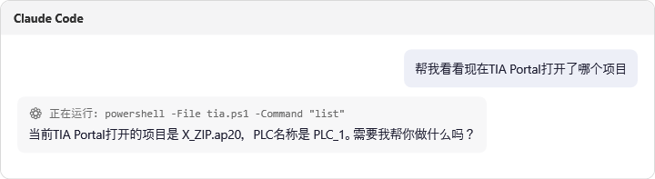
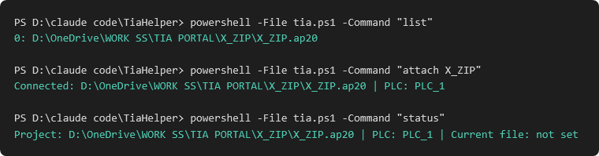
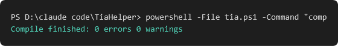

# 命名管道（Named Pipe）超详细使用教程 — 完全新手版

这篇教程假设你**从来没做过这种事**，会一步一步教你怎么让 AI 助手（本教程用 **Claude Code** 举例）
直接跟 TIA Helper 对话，帮你操作 TIA Portal —— 比如让 AI 帮你导入代码、编译、检查项目状态。

不需要写代码，不需要懂编程，跟着做就行。

---

## 第一步：这东西到底是什么？

TIA Helper 这个软件，除了让你自己用鼠标点按钮之外，还开了一个"后门"（其实是正规的功能，不是漏洞）——
一个叫做"命名管道"的东西，名字是 `tia_helper`。

你可以把它想象成一根**看不见的电话线**：

- 只要 TIA Helper 这个软件在你电脑上开着，这根"电话线"就通着。
- 任何程序（包括 AI 助手）都可以往这根线里"喊一句话"（一个指令，比如"看看现在连的是哪个项目"）。
- TIA Helper 会"回一句话"给你（结果）。
- 说完这一句，电话就挂断——每次都是"打一次电话，问一句，挂断"，不是一直占线。

**你不需要自己去操作这根"电话线"** —— 你只需要让 AI 助手（比如 Claude Code）去操作它就行，
AI 会用一个小脚本文件帮你完成"打电话"这个动作。

---

## 第二步：准备工作（只需要做一次）

1. 确认 TIA Helper 正在运行（你能看到浮动的圆形工具栏）。
2. 从这个仓库下载 [`tia.ps1`](../tia.ps1) 这个文件，保存到你电脑上一个你记得住的文件夹，
   比如 `D:\claude code\TiaHelper\tia.ps1`。

   - 这个文件就是刚才说的"打电话的工具"——它本身很短，只有十几行代码，专门负责
     "连接电话线 → 说一句话 → 听回复 → 挂断"，别的什么都不做。
   - 你不需要看懂它里面写了什么，也不需要修改它。

就这样，准备工作完成了。

---

## 第三步：让 AI 助手（Claude Code）帮你用它

打开 Claude Code（或者任何支持执行终端命令的 AI 工具），直接用**中文正常说话**就行，
比如：

> 帮我看看现在 TIA Portal 打开了哪个项目

Claude Code 看到这句话之后，会自己想到要运行下面这样一行命令（你不需要自己打这行）：

```powershell
powershell -File tia.ps1 -Command "list"
```

然后把结果读给你听，整个过程长这样：



你看，你只需要说人话，AI 自己知道该调用哪个命令、该怎么问 TIA Helper。

---

## 第四步（可选）：自己手动试一试，看看背后到底发生了什么

如果你想亲眼看看这根"电话线"到底是怎么工作的，可以自己打开一个终端窗口（比如
Windows 里搜索"PowerShell"打开它），切换到你保存 `tia.ps1` 的文件夹，然后照着打字：

```powershell
powershell -File tia.ps1 -Command "list"
```

回车之后，你会看到类似这样的结果：



上面这张图分成三段，我们一段一段讲：

1. **`list`** —— 意思是"告诉我现在有哪些 TIA Portal 项目开着"。结果显示：
   `0: D:\OneDrive\...\X_ZIP.ap20` —— 意思是"第0号项目"是这个路径。
2. **`attach X_ZIP`** —— 意思是"连接到路径里带 X_ZIP 这几个字的那个项目"。
   结果显示：`Connected: ...X_ZIP.ap20 | PLC: PLC_1` —— 连接成功了，PLC 叫 PLC_1。
3. **`status`** —— 意思是"告诉我现在连的是哪个项目、哪个PLC"。

再举一个例子，编译代码：

```powershell
powershell -File tia.ps1 -Command "compile"
```



`Compile finished: 0 errors 0 warnings` —— 意思是"编译完成，0个错误，0个警告"，一切正常。

---

## 第五步：AI 助手能帮你做哪些事？（命令清单）

下面这个表格是"电话线"支持的所有"暗号"（命令）。你不需要背下来 —— **Claude Code 自己知道
什么时候该用哪个**，这里只是给你一个参考，让你知道 AI 能力的边界在哪。

| 你想做什么 | AI 会用的命令 | 需要付费/授权吗？ |
|---|---|---|
| 看看现在有哪些 TIA 项目开着 | `list` | 不需要 |
| 连接到指定的项目 | `attach <关键词>` | 不需要 |
| 自动连接（只有一个项目开着时才行） | `autoattach` | 不需要 |
| 看看现在连的是哪个项目/PLC | `status` | 不需要 |
| 断开连接（TIA Portal 本身不会关） | `detach` | 不需要 |
| 列出所有可以导出的程序块 | `exportlist` | 不需要 |
| 预览一下"下载"会做什么（不会真的下载） | `downloadpreview` | 不需要 |
| 列出可用的下载接口 | `downloadinterfaces` | 不需要 |
| 导入一段代码（.scl 文件）到 PLC | `import <文件路径>` | **需要** |
| 把某个程序块导出成文件 | `export <名字> <保存路径>` | **需要** |
| 导出任何类型的程序块（包括梯形图），存成 XML | `exportxml <名字> <保存路径>` | **需要** |
| 批量导出所有梯形图类的程序块 | `exportxmlall <文件夹路径>` | **需要** |
| 编译 PLC 程序 | `compile` | **需要** |
| 选择用哪个下载接口 | `selectdownloadinterface <编号>` | **需要** |
| **真正下载到硬件** | ❌ 永远拒绝，见下方安全规则 | — |

---

## 第六步：三条你必须知道的安全规则

这三条不是"建议"，是这个功能**从代码层面就写死了**，AI 不可能绕过：

### 1️⃣ AI 不能自己瞎猜要连哪个项目
如果你同时开着好几个 TIA 项目，AI 必须先问你"你说的是哪一个"，绝对不会自己蒙一个连上去。

### 2️⃣ 导入代码会覆盖原来的程序块
如果你让 AI 导入一段新代码，只要名字一样，**原来的旧代码就没了**。建议先让 AI 帮你导出一份
备份，或者看看新旧代码有什么区别，再决定要不要导入。

### 3️⃣ "真正下载到硬件"这件事，AI 永远做不到
不管你怎么要求，AI 通过这根"电话线"**永远无法**把程序真的下载到你的 PLC 硬件上 ——
这是故意设计成这样的：下载到真实硬件是个大事，必须由**你自己**在软件界面上点击
"Run"按钮、看到弹出的确认框、自己按确认，才能进行。AI 最多只能帮你"预览"一下会发生什么。

---

## 常见问题

**Q: 我需要一直开着这个 tia.ps1 窗口吗？**
不需要。每次调用它就像打一次电话，说完就挂，不需要一直开着。

**Q: AI 说连不上，是不是坏了？**
先检查 TIA Helper 这个软件是不是真的在运行（能看到浮动圆形工具栏）。如果没开着，
这根"电话线"根本不存在，当然连不上。

**Q: 除了 Claude Code，别的 AI 工具能用吗？**
能。任何能执行终端命令的 AI 工具都行（比如支持 Shell/命令行的助手）。如果你的 AI 工具
支持更"原生"的连接方式（不用打命令行），可以看看 [MCP 使用教程](MCP.md) —— 那个更简单，
AI 甚至不需要知道"命令行"这个概念。
